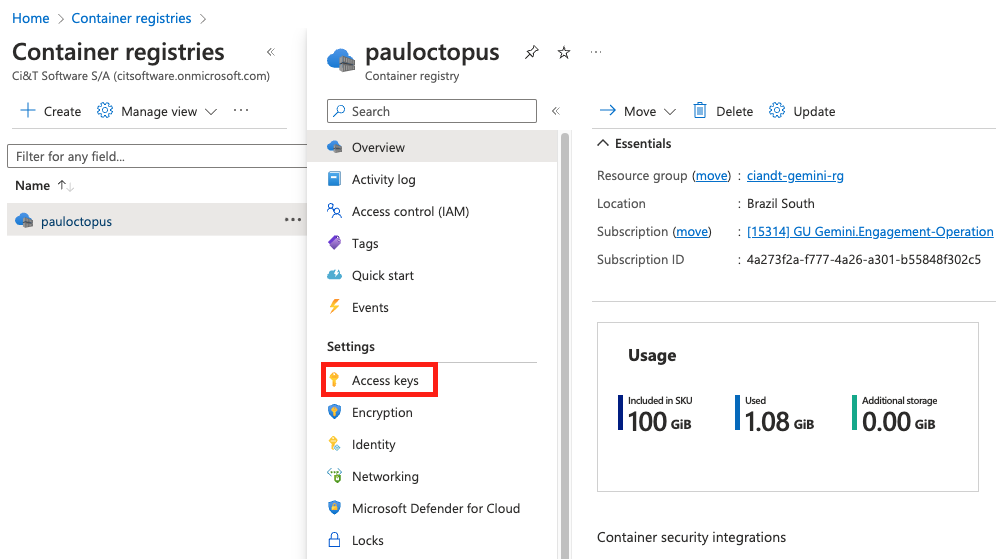
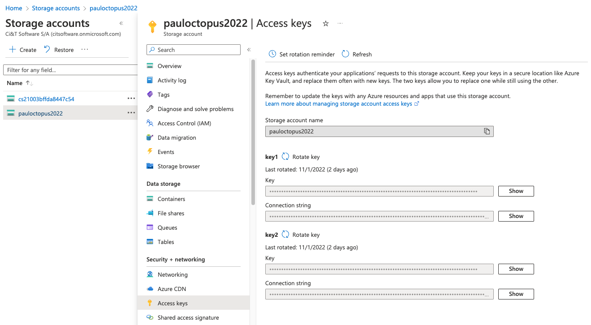
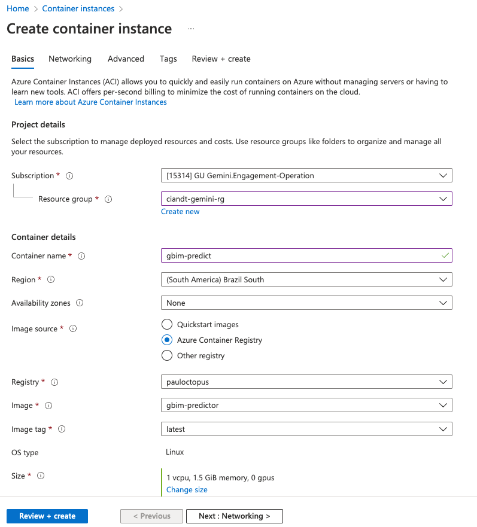
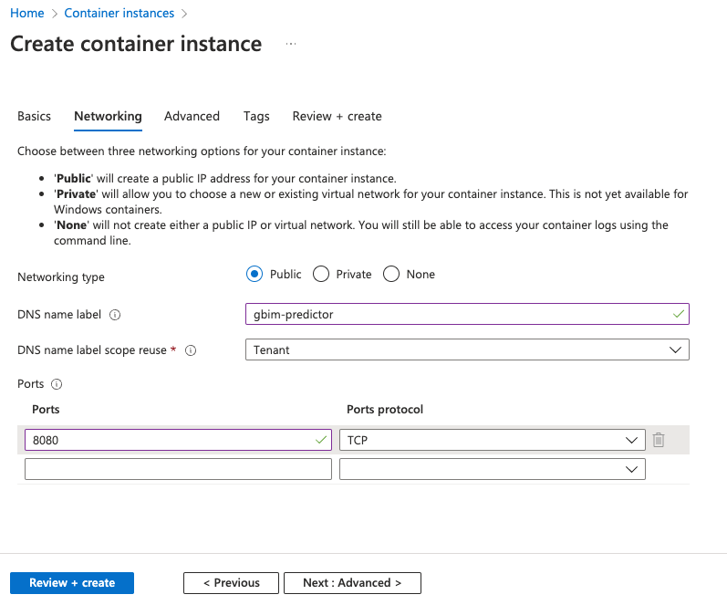
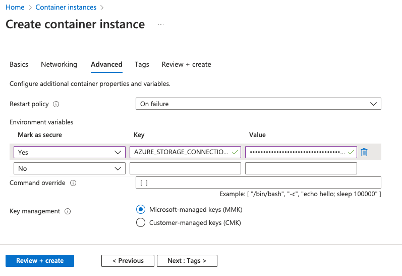

# paul-octopus-python

You can use this Python code to construct your solution to predict the results of the 2022 World Cup.

This is a Python webapp, and you will need to deploy it in a cloud provider.
In this example we will use the Azure Container Instances to run the webapp and generate the predictions.

## Requirements
- Docker
- Python

## Azure Container Registry (ACR)
In this example we will use the Azure Container Registry to push our Docker image containing the webapp.

The provided Azure environment already have an ACR instance named `pauloctopus`.
You can use it, or you can create your own instance of ACR.

To start using the ACR to push images from your local environment, you will first need to authenticate.

```
docker login pauloctopus.azurecr.io
```

The username and password to authenticate can be found in the Azure Portal.
Search for the Azure Container Registry, go into the `pauloctopus` instance, and click in the Access keys blade.
There you will find the username and password to authenticate.




## Configuring your development environment
This solution needs to access an Azure Storage Account to download the csv files with data.
You will need to provide an environment variable with the Storage Account connection string.

You can find the connection string in the Azure Portal, by accessing the `pauloctopus2022` Storage Account and clicking on the Access keys blade.



Show and copy one of the connection strings, and set the following environment variable inside your Python IDE.

```
AZURE_STORAGE_CONNECTION_STRING=DefaultEndpointsProtocol=https;AccountName=pauloctopus2022;AccountKey=xxxxxxx;EndpointSuffix=core.windows.net
```

## Implementing your code to predict matches
Feel free to change or adapt anything in this solution.

If you just want to write a function to predict a match, based on the teams that are playing, you just need to create a new python file inside `predictor` folder, and extend the `AbstractPredictor` class.

One dummy predictor called `OneZeroPredictor` is included as an example.

Remember that you will need to use at lease one of the dataset files provided inside the Storage Account.


## Building and pushing your docker image
When you have your predictor implemented, you can build the docker image using the provided Dockerfile.

Include your login in the image, to avoid conflicts with others that are sharing the same environment.
```
docker build -t pauloctopus.azurecr.io/<login>-predictor .
docker push pauloctopus.azurecr.io/<login>-predictor
```

This will push your predictor WebApp to ACR, and it will be available to deploy using the Azure Container Instances.

## Deploy in Azure Container Instances (ACI)
Azure Container Instances is an easy way to deploy your WebApp in the Azure platform.
You can use the Azure Portal, search for Azure Container Instances, and create a new app there.

### Basics
On the first step, you will need to fill the `container name` with your app name (remember to include your login to avoid conflict).
Select the option to use the image from ACR, and then select the image that you just pushed on the previous step.



### Networking
On the networking tab, you can choose a part of the DNS name to access your webapp after the deployment.
In this example we are using "gbim-predictor" as part of the DNS.

**IMPORTANT: You will also need to change the exposed port to be `8080`. This is the port that we are serving the app.** 



### Advanced
On the advanced tab, you will need to configure the `AZURE_STORAGE_CONNECTION_STRING` environment variable.
This is the same variable that you configured for your development environment.
This is the connection string that will allow your app to download csv files from the storage account. 



### Review and create
After configuring the container instance, you will review and create it.


Wait for the creation of the Container Instance. You can explore the portal, check the logs and make sure that the app is running. 

## Accessing your App and generating the Predictions
After the deployment of your app, you can check the `Overview` tab and get the full DNS where it is available.


You can now access the app from your browser (don't forget to put the `8080` port at the URL).


### Running a predictor class
The way that this solution is implemented, you can pass the name of your predictor in the URL like the following example:
```
http://gbim-predictor.caeja3fbbzdfb0gz.brazilsouth.azurecontainer.io:8080/predict/OneZeroPredictor
```

In this example, it will instantiate the `OneZeroPredictor` class and call the method to make predictions.
The browser will download the CSV file called `predictions.csv`.

This file that you just download contains the predictions from your algorith and should be ready to submit.